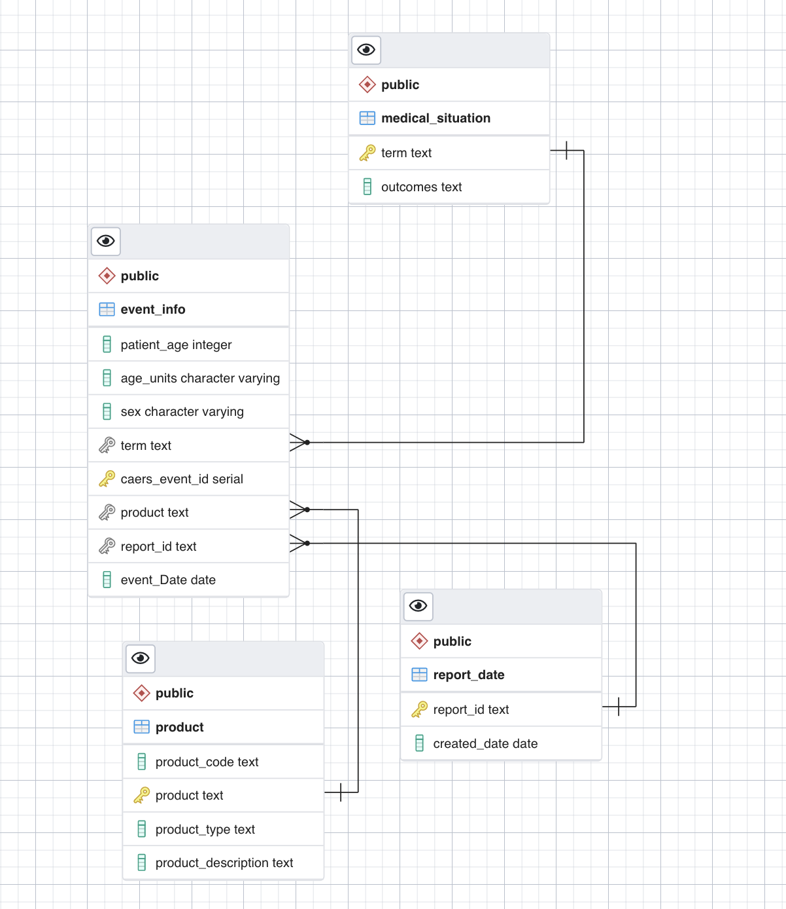

## Part 1: Create an ER Diagram by inspecting tables…
contries has a one to many relationship with country_stats, this relationship exists because of a foreign key called country_id in country_stats  that references countries

regions has a one to many relationship with countries, this relationship exists because of a foreign key called region_id in countries that references regions

continents has a one to many relationship with regions, this relationship exists because of a foreign key called continent_id in regions that references continents

countries has a many to many relationship with languages which need a third table country_language to store relationship between countries and languages tables.

## Part 3: explore
1. report_id is not unique
2. report id & creation date together is not unique
3. product code and report_id together is not unique
4. product code, product_type, product and report_id combined togther is unique because the largest count is 1. finally, this set become a candidate key. 

## Part 3: Examine a data set and create a normalized data model to store the data

- the event info table is the "main table" that takes caers_event_id as primary key 
- medical_situation has a one to many relationship with event-info where term in medical_situation references term in event_info. 
- report_date has a one to many relationship with event-info where report_id in report date references report_idin event_info. 
- product column in product table references product in event_info. Product has a one to many relationship with event_info. 
- one event info contain only one medical_situation, one report date and one product. A product and report date and also medical_situation can be involved in multiple events. 